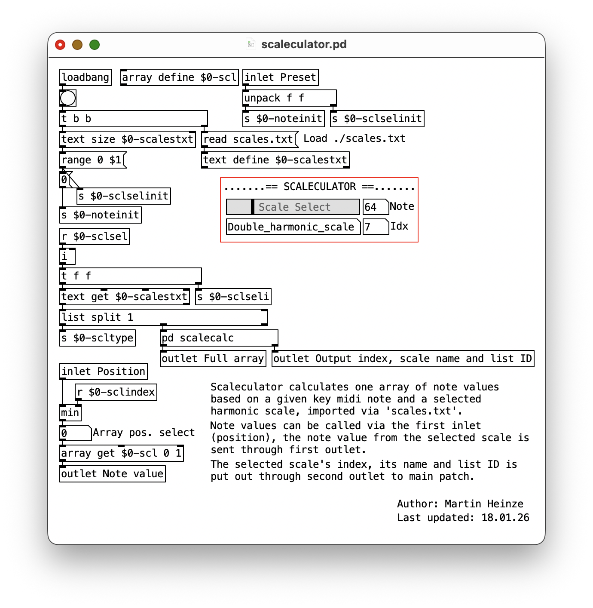
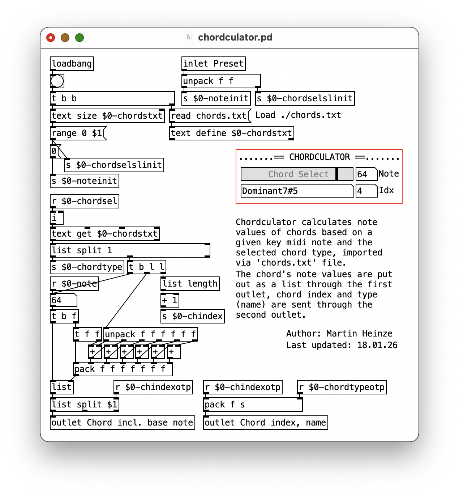
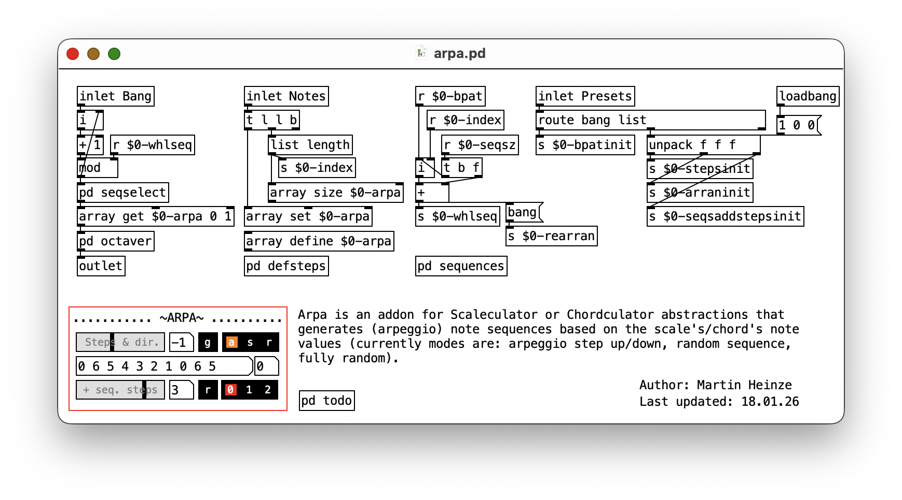
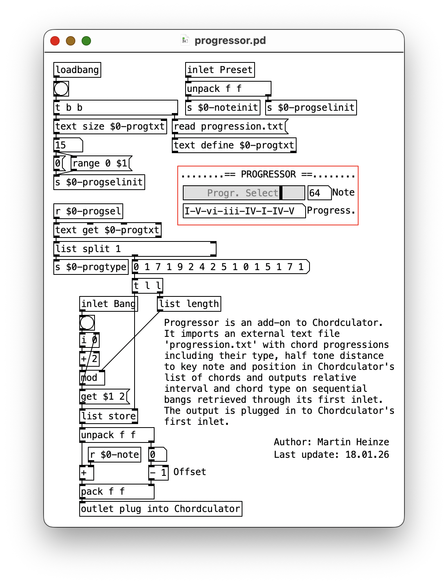

# PD-melculators
This repository contains Pure Data abstractions for melodic scales, chords, and tonal sequences in algorithmic composition.

*Latest version:* v0.1.0

## Abstractions
### Scaleculator
 \
Scaleculator calculates one array of note values based on a given key midi note and a selected harmonic scale, imported via 'scales.txt'. Note values can be called via the first inlet (position), the note value from the selected scale is sent through first outlet. The selected scale's index, its name and list ID is put out through second outlet to main patch.
### Chordculator
 \
Chordculator calculates note values of chords based on a given key midi note and the selected chord type, imported via 'chords.txt' file. The chord's note values are put out as a list through the first outlet, chord index and type (name) are sent through the second outlet.
### Arpa
 \
Arpa is an addon for Scaleculator or Chordculator abstractions that generates (arpeggio) note sequences based on the scale's/chord's note values (currently modes are: arpeggio step up/down, random sequence, fully random).
### Progressor
\
Progressor is an add-on to Chordculator. It imports an external text file 'progression.txt' with chord progressions including their type, half tone distance to key note and position in Chordculator's list of chords and outputs relative interval and chord type on sequential bangs retrieved through its first inlet. The output is plugged in to Chordculator's first inlet. 

---

## License
<a href="https://github.com/devstermarts/PD-melculators">PD-melculators</a> © 2026 by <a href="https://github.com/devstermarts">Martin Heinze</a> is licensed under <a href="https://creativecommons.org/licenses/by-sa/4.0/">CC BY-SA 4.0</a>
